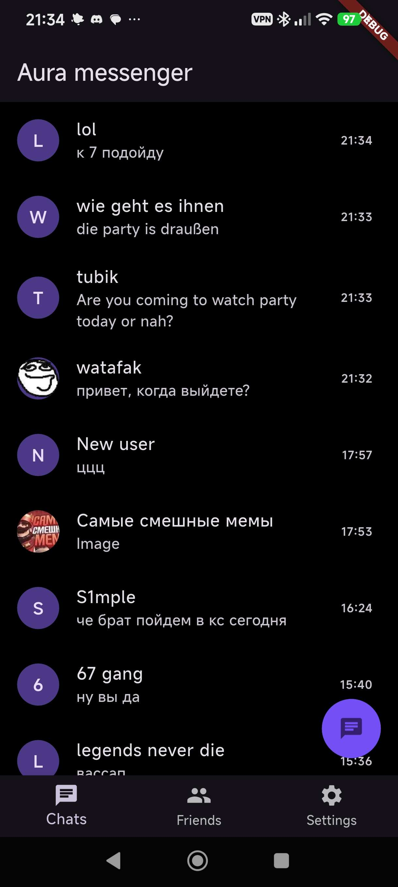
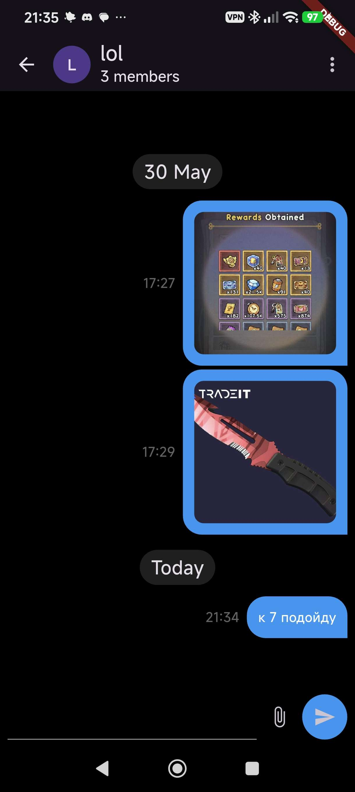
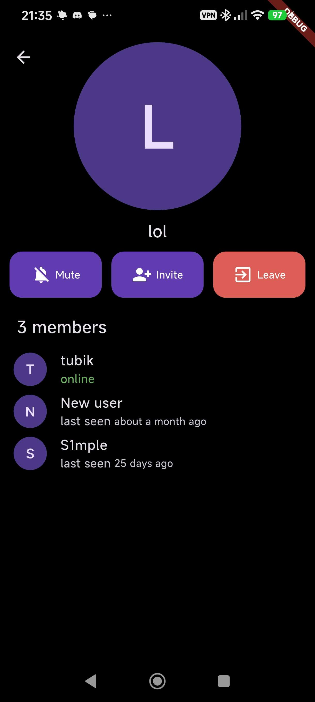
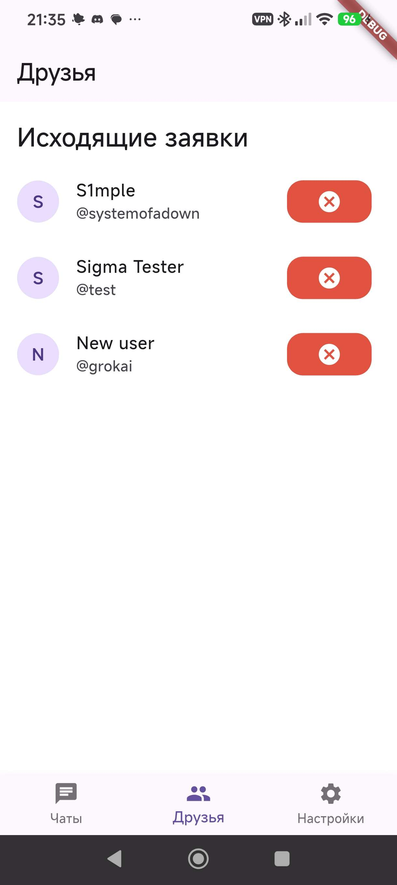

# 💬 Flutter BLoC Messenger

[](https://flutter.dev)
[](https://dart.dev)
[](#-architecture)
[](#-tech-stack)

A full-featured real-time cross-platform messenger built with **Clean Architecture** using **BLoC**, a hybrid backend (Firebase + Supabase), and a dedicated microservice for secure push notifications. (Work in progress)

---

## 📱 Screenshots

<p align="center">
  
  &nbsp;
  
  &nbsp;
  
  &nbsp;
  
</p>

---

## ✨ Key Features

### 🚀 Chats & Realtime
* **Realtime Messages & Online Statuses:** Instant message delivery and user presence tracking.
* **Custom Pagination:** Optimized message history loading on scroll without FPS drops.
* **Optimistic UI Updates:** Instant UI response when sending messages before backend confirmation.

### 🛡️ Security & Backend Architecture
* **Multi-backend:** 
  * **Firebase** — authentication, primary database, and real-time events.
  * **Supabase** — high-performance media file storage and downloads.
* **Secure Push Notifications (FCM):** Push notifications are sent via an isolated microservice on **Render**, preventing Firebase service key leaks from the client.
* **Security Rules:** Strict data access rules on the backend side.

### 🎨 UX / UI & Multimedia
* **Gallery & Media:** Photo viewing with zoom (`photo_view`), downloading media to the device gallery (`gal`, `dio`).
* **Customization:** Support for light and dark themes.
* **Localization (l10n):** Multi-language interface support.

---

## 🏗️ Architecture

The project strictly follows **Clean Architecture** principles and is divided into isolated layers:

```
lib/
├── domain/       # Entities, UseCases, Repository Interfaces
├── data/         # Models, DataSources (Firebase/Supabase), Repositories Implementation
└── presentation/ # BLoC / Cubit, Screens, Widgets
```

---

## 🛠️ Tech Stack
* **Core:** Flutter, Dart
* **State Management:** `flutter_bloc`, `equatable`
* **Backend:** Firebase (Auth, Firestore, FCM), Supabase Storage
* **Microservices:** Node.js backend hosted on **Render** (for FCM)
* **Networking & Media:** `dio`, `gal`, `photo_view`
* **Local Storage:** `shared_preferences`
* **Localization:** `flutter_localizations` (`l10n`)

---

## 🚀 Getting Started

1. **Clone the repository:**
   git clone https://github.com/tub1k/messenger.git
   cd messenger

2. **Install dependencies:**
   flutter pub get

3. **Run the project:**
   flutter run
